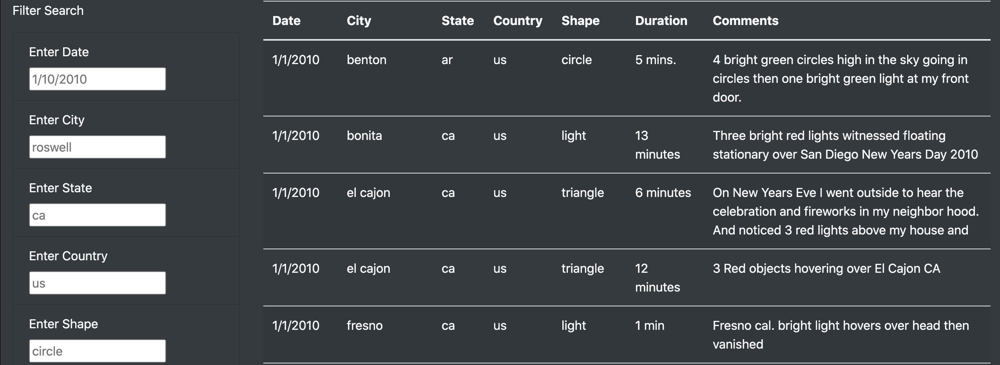
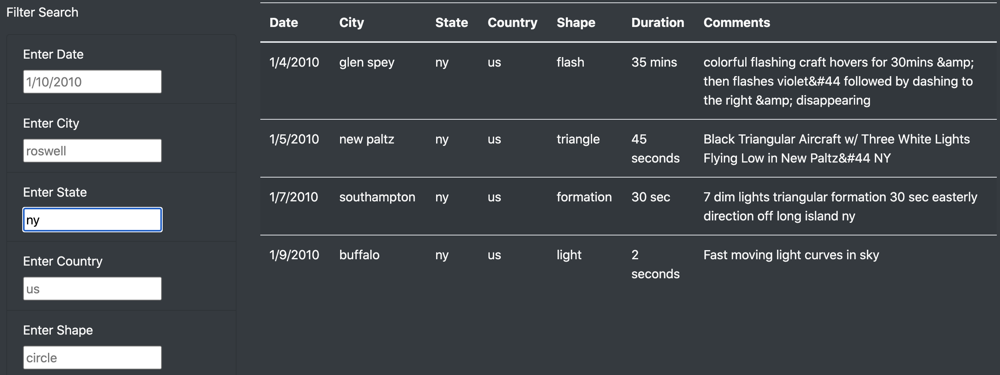

# UFO Sightings

## Overview

For this project, we were tasked with building a HTML webpage for our client, a data journalist, who wants visualize a collection of UFO sightings, and allow users to filter through the results. She supplied us with a javascript file with data entries of each UFO sighting with the date, city, state, country, shape and other criteria. All of her data has been placed into a table format with 5 filter options to allow users to search through the data, and accommodate her article.

## Results

As shown above, our webpage has 5 search filters for the table of UFO sightings, the date of the sighting, the city, the state, the country, and the shape of the UFO. Users have the freedom to search the data utilizing all five filters or as little as one if they choose. 

Below is an example of a search for sightings in New York state.

## Summary

We have created a HTML webpage with a dynamic table to support our client's article on UFO sightings with the ability for users to sort through the dataset. 

However, we do have suggestions for our client to help make the website easier for visitors to use, more interactive, and more dynamic. The most glaring issue with the current design of the page is that, although we have search criteria, users do not know the range of entries that are present in the data, such as the shape of the UFO, the cities, or the dates of the sightings. Thus, giving the available options for each category would make the user experience more enjoyable. Additionally, the webpage currently utilizes a static dataset of UFO sightings from 1/1/2010 to 1/13/2010. We would suggest possibly automating data collection from other sources to keep it up to date or allowing users to add their own entries. Lastly, we could add another page to the site, where we could have a gallery of UFO sighting pictures.
